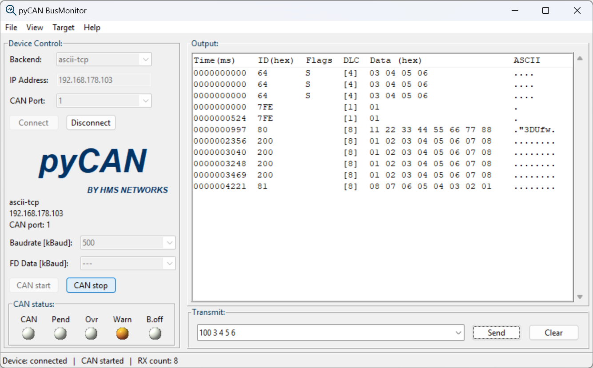

# pycan

`pycan` is a small transport-independent CAN API for Classic CAN and CAN FD.
It currently provides backends for CAN@net Basic via TLV UDP and ASCII UDP,
CAN@net NT ASCII TCP, IXXAT VCI (Windows), and an in-memory virtual bus.

Supported platforms: **Windows** and **Linux** (any platform with Python 3.12+
and standard sockets).

## Install

From a local checkout:

```powershell
python -m pip install .
```

For development (editable install — code changes take effect immediately):

```powershell
python -m pip install -e .
```

After installation, import the API from the `pycan` package:

```python
from pycan import CanMessage, ControllerConfig, CanTiming, OpenConfig, Transport
from pycan import CanUdp

can = CanUdp()
can.open(OpenConfig(transport=Transport.UDP, address="10.41.18.123", port=19236))
can.init_can(1, ControllerConfig(arbitration=CanTiming(bitrate_kbit=500)))
can.start_can(1)
can.send(1, CanMessage(0x200, b"\x11\x22\x33\x44"))
can.close()
```

## Layout

- `src/pycan/` - Package source code and backend implementations.
- `demos/` - Example scripts demonstrating pycan usage.
- `tests/` - Unit tests and the manual hardware integration suite.
- `docs/` - User documentation and chat handoff notes.
- `pyproject.toml` - Build and packaging metadata.

## Backends

- `pycan.CanUdp` - CAN@net Basic TLV UDP backend.
- `pycan.AsciiCan` - CAN@net ASCII backend for NT/TCP and Basic/UDP.
- `pycan.VciCan` - IXXAT VCI V4 backend (Windows, native DLL).
- `pycan.Virtual` - In-memory virtual backend for local tests.

## Demos

Example scripts are in the `demos/` folder:

```powershell
# Interactive send/receive terminal (all backends)
python demos/interactive.py --backend ascii-tcp --address 10.41.18.10 --bitrate 500
python demos/interactive.py --backend virtual --device vcan0

# Simple CAN@net NT send & receive (60s)
python demos/nt_send_receive.py --address 10.41.18.10
```

Available demos:

- `demos/interactive.py` — Interactive terminal: send standard/extended/FD messages, load test, live receive.
- `demos/nt_send_receive.py` — Minimal CAN@net NT example: send 4 messages, print status and received frames for 60s.

## Documentation

- [User Guide](docs/user_guide.md) — API concepts, initialization snippets, send/receive examples, and backend-specific notes.
- [API Reference](docs/api_reference.md) — Complete reference of all classes, enums, dataclasses, and methods.
- [Backend Overview](docs/backends.md) — Supported devices, capabilities, bitrates, timestamps, and register configuration.

## BusMonitor

The package includes a graphical CAN BusMonitor (Tkinter GUI) that supports all
pycan backends. After installation, start it from the command line:

```powershell
pcbm
```



Features:
- Backend selection: TLV-UDP, ASCII-TCP, ASCII-UDP
- IP address and CAN port configuration (1–4)
- Configurable bitrate
- Live receive display with timestamps, hex data, and ASCII decode
- Transmit command line with history
- CAN FD support (flags `F` for FD no BRS, `B` for FD+BRS, up to 64 bytes)
- Trace file logging

Transmit syntax:

```
<id> [E][R][F][B] [<data bytes> ...]
```

Examples:

```
100 11 22 33 44                Standard CAN, ID 0x100, 4 bytes
1ABCDEF0 E 01 02 03            Extended 29-bit ID
200 B 00 01 02 ... (64 bytes)   CAN FD with BRS
```

## History

### v1.1.0 (2026-05-19)

- **New backend: IXXAT VCI** — `VciCan` wraps the VCI V4 native DLL
  (`vcinpl2.dll`) via ctypes. Supports Classic CAN and CAN FD on any IXXAT
  interface (USB, Ethernet, PCIe). Windows only.
- VCI receive filtering implemented in software (up to 5 mask/value filters
  per port) for reliable operation across all IXXAT hardware variants.
- Matrix integration test (`can_matrix_test.py`) extended with optional
  `--vci` node.
- Documentation updated: backend overview, user guide, API reference.

### v1.0.0 (2026-05-13)

- Initial release with `AsciiCan` (TCP/UDP), `CanUdp` (TLV-UDP), and
  `Virtual` backends.
- Common `CanApi` interface: open, init, filter, start, send, receive, close.
- Classic CAN and CAN FD support.
- BusMonitor GUI (`pcbm`).
- Hardware integration test suite (`can_matrix_test.py`).

## License

This project is licensed under the MIT License — see [LICENSE](LICENSE) for
details.